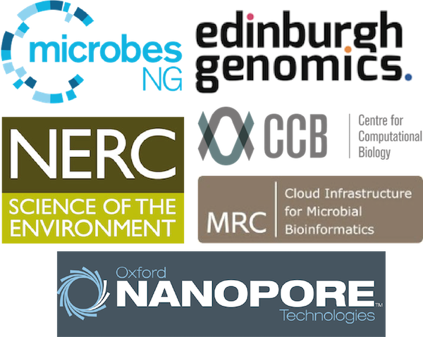

PoreCamp is a training bootcamp based around [Oxford Nanopore MinION](https://www2.nanoporetech.com//products-services/minion-mki) sequencing. It is a unique opportunity to learn about this exciting new sequencing platform from some of the leading experts in the field.

The series was founded by Nick Loman and Josh Quick in 2015 and has been run as a 1-week hands-on course.

PoreCamp2016 is about to commence! From 15-19 August, 42 participants from 13 countries will be at the Penryn Campus (Cornwall) of the University of Exeter.

Follow us on [Twitter](https://twitter.com/search?q=%23porecamp2016&src=typd) with #porecamp2016

# What is nanopore sequencing?

The Oxford Nanopore is a USB-size DNA sequencer which is capable of producing up to 1Gbase of sequence data with read lengths limited primarily by the input material. One of its key advantages is to produce data in near-real time - the system has been used to monitor the [Ebola outbreak](http://www.nature.com/nature/journal/v530/n7589/full/nature16996.html) in 2015, the [Zika outbreak](http://zibraproject.github.io/) in 2016, and in July 2016 became the first sequencer in [space](http://www.nasa.gov/mission_pages/station/research/experiments/2181.html).

# Who should attend?

Any researchers wanting training in library preparation, running the MinION Oxford Nanopore instrument, and data analysis are welcome to attend. Participants do not require both wet-lab and bioinformatics skills to benefit from the course - training will be provided in both components.

# Course structure and programme

PoreCamp is currently run as a 1-week course. It is entirely hands-on. The aim is to provide hands-on training by researchers, for researchers in library preparation, running the instrument and the analysis of data as well as the opportunity to meet the current world leaders.

The programme and teaching materials for previous courses can be found at:

- [PoreCamp2016](2016/index.html) (15 - 19 August 2016, University of Exeter, Penryn Campus, Cornwall)
- [PoreCamp2015](2015/index.html) (14 - 18 December 2015, University of Birmingham)

# Registration

Applications for Porecamp 2016 (August 2016) have closed, please keep an eye out for future Porecamps in 2017.

# Admission Criteria

Places are **strictly limited**. Places will be allocated according to the following strict criteria.

You must:

- be a member of the MinION Access Programme;
- have basic hands-on experience of the MinION and/or MinION data analysis;
- have a background in either bioinformatics and/or wet lab work; and
- be able to attend ALL FIVE days of the course; this is non-negotiable.

In the event the course is over subscribed, the instructors will allocate places according to the strength of the application and the applicant’s relevant experience.

# Acknowledgements

Thank you to the following organisations for providing support (time, bursaries, reagents, space) to PoreCamp:

